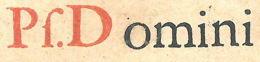
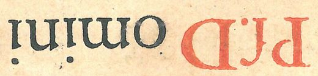

# Understanding IIIF Image Presentation

## Working with IIIF Images

\(In-class exercise\)

Using IIIF can be a very complex business, but the idea behind it is that it should be accessible for relatively simple uses as well. Behind the scenes, the library IT staff has made your access to IIIF images fairly straightforward by hosting them in their own IIIF server \(we're Carleton's first IIIF pilot project!\).  The previous page has laid out some of the key url's to access the images, but here we will try to take you through a more practical introduction to them. 

Navigate in your browser to the address below to see all the images we have of the images for the manuscripts and manuscript fragments in Carleton's collection.

```
https://viewer.library.carleton.ca/2018-07-07-hist4006-manuscriptimages/
```


 The library viewer that you see referenced in the url above allows you to download directly all the image files that we have hosted on the IIIF server, but is NOT the server itself. It may be necessary, however, to use the files names listed there to figure out what the complete address for the IIIF server of your images are. 


Using the above webpage, track down the file name for the \(at minimum\) two images associated with the folio you worked on last term. For example, if you were working on the CUAG folio no. 13, you would find these two files listed:

```
CUAG_1995.62.13a.tif
CUAG_1995.62.13b.tif
```

In order to see the above image from the IIIF server, the above image file name \(2\) needs to be sandwiched between the prefix \(1\) identifying the location of the IIIF server and the suffix \(3\) which specifies how the server should present the image you have requested. 

```text
1. https://iiif.library.carleton.ca/iiif/2/2018-07-07-hist4006-manuscriptimages%2F
2. CUAG_1995.62.13b.tif
3. /full/full/0/default.jpg
```

Put together, your browser will show you the [image](https://iiif.library.carleton.ca/iiif/2/2018-07-07-hist4006-manuscriptimages%2FCUAG_1995.62.13b.tif/full/full/0/default.jpg) you have requested. Try this with your folio. It might take a couple attempts to make sure you have all the parts of the address right. When using this set up \(i.e. with this suffix\), the whole image is served up and allows you to switch between a full zoom and the zoom to fit your screen. 

The suffixes, however, allow you to select only parts of the image and the degree of zoom you may request. The suffix, however, allows you to play with this. I suggest you take a look at:

*  an [IIIF Image API Playground](https://www.learniiif.org/image-api/playground) set up by Stanford, which allows you to play with the settings of the images served to you
* and [the IIIF Image API parameters](https://iiif.io/api/image/2.1/#image-information-request-uri-syntax)

Basically the parameters allow you to specify what **size**, what **part** of the images, what **colour** and at what **magnification** of the image the server sends out. 

In the example above, the suffix part of the address for CUAG fol. 13 reads:

```text
/full/full/0/default.jpg
```

The first `/full` means that the entire **region** of the image is displayed. The second `/full` means the largest **size** will be displayed. The `/0` means that the original **rotation** is maintained and the`/default.jpg` means that the default **quality** \(i.e. colour type\) is offered. 

### Region

You can change the region to be only a portion of the photo, presenting only a square for example, or a defined region of the image. We'll do both with the image we have been looking at: 

* [The server can automatically serve up the image as a square](https://iiif.library.carleton.ca/iiif/2/2018-07-07-hist4006-manuscriptimages%2FCUAG_1995.62.13b.tif/square/full/0/default.jpg) \[Click on the link\]
* [Or as a selection](https://iiif.library.carleton.ca/iiif/2/2018-07-07-hist4006-manuscriptimages%2FCUAG_1995.62.13b.tif/1200,2050,1040,250/full/0/default.jpg). 

In the second image, you should see only a small selection of the image \[_Psalmus: Domini_\], as below:


The suffix for this image is:

`/1200,2050,1040,250/full/0/default.jpg`

Instead of `/full`, we now have a series of numbers separated by commas. These are coordinates. The first `/1200` indicates that the selection of the image begins at pixel 1200 on the horizontal axis. The second number `2500` specifies that the selection of the image begins at pixel 2050 on the vertical axis. `1040` indicates that the selection is 1040 pixels in width, and `250` indicates that it is 250 high \(progressing rightwards and downwards from the specified starting points\). 


If you are using Chrome as your browser you can easily install a "page ruler" extension, [such as this one](https://chrome.google.com/webstore/detail/page-ruler/emliamioobfffbgcfdchabfibonehkme), to visualize the pixel locations of images.


### Size

Without changing the pixels locations specified above, we might only want to see this image at half the original size \(or 50 percent\). 

* [https://iiif.library.carleton.ca/iiif/2/2018-07-07-hist4006-manuscriptimages%2FCUAG\_1995.62.13b.tif/1200,2050,1040,250/pct:50/0/default.jpg](https://iiif.library.carleton.ca/iiif/2/2018-07-07-hist4006-manuscriptimages%2FCUAG_1995.62.13b.tif/1200,2050,1040,250/pct:50/0/default.jpg)

Looks like this \(it should be smaller than the other one unless your browser window is narrow and has auto-adjusted the size of the images\): 



You can also specify two values separated by a comma in order to define width and height instead of percentage size. 

### Rotation

You can rotate, by supplying the third value with a number between 0 and 360 degrees. The following is rotated 180 degrees:

* [https://iiif.library.carleton.ca/iiif/2/2018-07-07-hist4006-manuscriptimages%2FCUAG\_1995.62.13b.tif/1200,2050,1040,250/pct:50/180/default.jpg](https://iiif.library.carleton.ca/iiif/2/2018-07-07-hist4006-manuscriptimages%2FCUAG_1995.62.13b.tif/1200,2050,1040,250/pct:50/180/default.jpg)



### Quality

Ideally, you can substitute "bitonal" or "gray" of "color"  \(note American spellings\) for default.jpg, but this doesn't seem to be working in our case. So, well, trust me that it _can_ work. 

