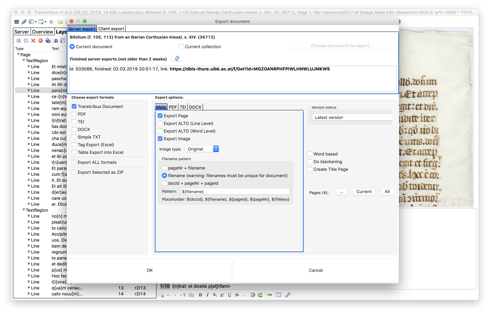

# TEI export from Transkribus


 You can take a look at an exported transcription of CU, ARC, scans 27-30 as a TEI export on [Gitbook](https://github.com/MarcSaurette/Gitbook/blob/master/week-19/Bifolium_%28f__105%2C_112%29_from_an_Iberian_Carthusian_missal%2C_s__XIV__tei.xml). Much of the initial section of the TEI xml file is devoted to identifying parts of the images where text is located \(i.e. the "zone points' in the &lt;facsimile&gt; section\). From lines 250 until the end, the &lt;text&gt; block records the transcription of two columns of 24 lines per page \(multiplied by four pages\). Letters in \[square\] brackets are expanded abbreviations. 


## Exporting to TEI from Transkribus

1. Open and login to Transkribus
2. Ensure the "Ottawa, ARC, Carleton University ..." Collection is selected in the drop down menu entitled "Collections" on the "Server" tab. 
3. Double-click on the item with the ID 36712 \(current title, "Bifolium \(f. 105, 112\) from an Iberian Carthusian..."\).
4. Look to the icons along the top left corner and locate the icon of the folder with a green arrow pointing right. 
5. An export window will pop up, which should look like the following:



1. In the top left corner, click on the "Client Export" tab. 
2. For an easy export, you can save the image as a PDF with a text layer.
3. But for our purposes, it is more useful to export it as TEI, so click on the TEI box in the left column \(and unclick others\). Leave export options as is. 
4. It will ask you where to save the file and will take a few moments to export after you have confirmed the export. 
5. Locate the file and open it with Atom. It will have the TEI Header that you are now familiar with. 
6. This file, however, will also have a reference to a "facsimile", which are the digital images of the bifolium.

```
<?xml version='1.0' encoding='UTF-8'?>
<TEI xmlns='http://www.tei-c.org/ns/1.0'>
	<teiHeader>

...

<facsimile xml:id='facs_1'>
		<surface ulx='0' uly='0' lrx='5090' lry='7010'>
			<graphic url='manuscript027.tif' width='5090px' height='7010px'/>
			<zone points='1238,843 1238,6732 2774,6742 2774,853' rendition='TextRegion' xml:id='facs_1_r1'>
```

Scroll down to line 250 and you will see the beginning of the transcription, referencing the earlier cited fascimile images:

```
	<text>
		<body>
			<pb facs='#facs_1' n='1'/>
			<p facs='#facs_1_r1'>
				<lb facs='#facs_1_r1l1' n='N001'/>Et misit Petru[m] et Ioh[ann]em
				<lb facs='#facs_1_r1l2' n='N002'/>dice[n]s: eu[n]tes parate [no]b[is]
				<lb facs='#facs_1_r1l3' n='N003'/>pascha. ut ma[n]ducem[us].
				<lb facs='#facs_1_r1l4' n='N004'/>At illli dixerunt. Ubi uis.
				<lb facs='#facs_1_r1l5' n='N005'/>pare[mus]? Et dix[it] ad eos. Ec-
				<lb facs='#facs_1_r1l6' n='N006'/>ce i[n]troeu[n]tibus uob[is] i[n] ciui-
				<lb facs='#facs_1_r1l7' n='N007'/>tate[m]: occurret uob[is] ho[mo] a[m]pho-
				
				...
				
```

And you're done!

