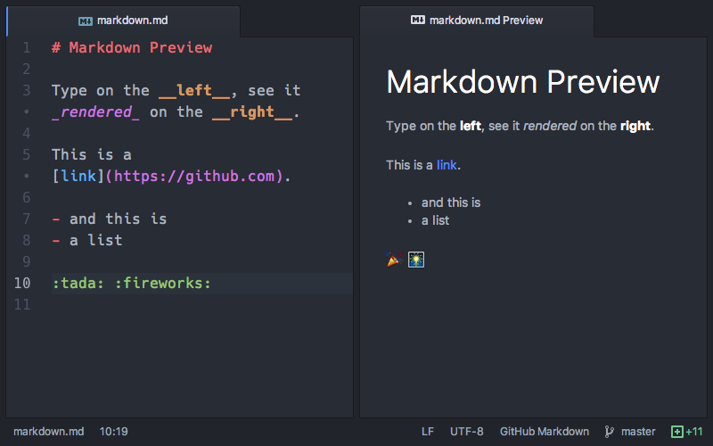

# Markdown




The benefit of using Atom as your Markdown editor is that it comes with pre-installed plugins for Markdown:   
‣ Language-Markdown \(which highlights syntax\),  
‣ and Markdown-preview \(which allows you to view a real-time preview of your Markdown product\).


**Step 1:** Open Atom and copy + paste the following template:

```text
# This is Kate's Markdown file
***
Here is a list of reasons I joined HIST 4006A:

- improve my __digital humanities skills__
- learn _more_ about codicology and palaography
- make an **online project** I can put on my CV
- meet *awesome* medievalists

### More about me
Here is a link to [my Hcommons profile](https://hcommons.org/members/katebrasseur/)

Here are four emoticons that represent me:

1. :european_castle:
2. :cat2:
3. :cherry_blossom:
4. :rainbow:
```

And then **File** &gt;&gt; **Save As..**. and name the file like this:

```text
last name_first name.md
```

**Step 2:** Navigate to the **Packages** tab and select **Markdown Preview** &gt;&gt; **Toggle Preview** to see a live preview of your Markdown in action.   
You should see the code about translated to a Markdown file.

**Step 3:** Replace the example text with your own, check to make sure you get the syntax correct by checking the Markdown Preview. Once you are satisfied with your work, learn how to contribute the file to our repository on Github in the [next lesson](github.md).

